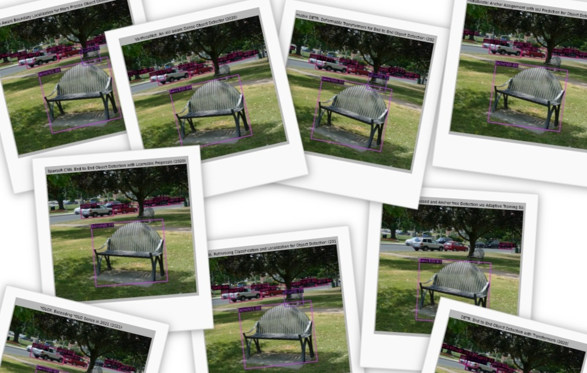

# Object Detection

In this tutorial, you will:
- Perform inference with 10 well-known pre-trained object detectors <a href="http://colab.research.google.com/drive/1AVgdWQ8LTrn6MrGyamKSUT17n_F_cCG2?usp=sharing" target="_parent"></a>
- Fine tune object detectors on a custom dataset <a href="https://colab.research.google.com/drive/1pfMiefP8t2nhb92IHKgYmjfdorHSt2VD?usp=sharing" target="_parent"></a>
- Design and train your own object detector <a href="https://colab.research.google.com/drive/1_yINCuTRs9SYdPXEFTOsxoqQvWbyz1Tq?usp=sharing" target="_parent"></a>


## 10 Object detectors

| Detector      | Paper         |
| ------------- |:-------------:|
| [YOLOF](https://arxiv.org/abs/2103.09460)    | You Only Look One-level Feature (2021)
| [YOLOX](https://arxiv.org/abs/2107.08430)    | Exceeding YOLO Series in 2021 (2021)
| [DETR](https://arxiv.org/abs/2005.12872)    | End-to-End Object Detection with Transformers (2020)
| [Deformable DETR](https://arxiv.org/abs/2010.04159)    | Deformable Transformers for End-to-End Object Detection (2021)
| [SparseR-CNN](https://arxiv.org/abs/2011.12450)    | End-to-End Object Detection with Learnable Proposals (2020)
| [VarifocalNet](https://arxiv.org/abs/2008.13367)    | An IoU-aware Dense Object Detector (2020)
| [PAA](https://arxiv.org/abs/2007.08103)    | Probabilistic Anchor Assignment with IoU Prediction for Object Detection (2020)
| [SABL](https://arxiv.org/abs/1912.04260)    | Side-Aware Boundary Localization for More Precise Object Detection (2020)
| [ATSS](https://arxiv.org/abs/1912.02424)    | Bridging the Gap Between Anchor-based and Anchor-free Detection via Adaptive Training Sample Selection (2019)
| [Double Heads](https://arxiv.org/abs/1904.06493)    | Rethinking Classification and Localization for Object Detection (2019)

-----

## Perform inference 

<a href="http://colab.research.google.com/drive/1AVgdWQ8LTrn6MrGyamKSUT17n_F_cCG2?usp=sharing" target="_parent"></a>

Here is how to load a pretrained model, perfrom inference and vizualza the results.

```
model = init_detector(config, checkpoint, device='cuda:0')
result = inference_detector(model, img)
show_result_pyplot(model, img, result, title=m_name, score_thr=0.6)
```


And more examples ... 



-----

## Fine tune object detectors on a custome dataset

<a href="https://colab.research.google.com/drive/1pfMiefP8t2nhb92IHKgYmjfdorHSt2VD?usp=sharing" target="_parent"></a>

We can select a pre-trained model, and fine-tune it on a cutome dataset. kitti_tiny is a tiny version of the well known [KITTI](http://www.cvlibs.net/datasets/kitti/) dataset is used here as the custom dataset. 


While fine-tuning a pretrained model, we should select a small learning rate, monitor the loss and malke sure it is decreasing, etc. For object detection, the loss is comosed of 2 main components:
- Classification loss
- Bounding Box loss


```
- Epoch [1][10/50]	loss_cls: 0.4056, loss_bbox: 0.3570, loss: 0.7625
- Epoch [1][20/50]	loss_cls: 0.3316, loss_bbox: 0.3062, loss: 0.6378
- Epoch [1][30/50]	loss_cls: 0.5663, loss_bbox: 0.3815, loss: 0.9478
- Epoch [1][40/50]	loss_cls: 0.4196, loss_bbox: 0.3604, loss: 0.7801
- Epoch [1][50/50]	loss_cls: 0.4421, loss_bbox: 0.2568, loss: 0.6989
- Epoch [2][10/50]	loss_cls: 0.2546, loss_bbox: 0.3497, loss: 0.6043
- Epoch [2][20/50]	loss_cls: 0.2809, loss_bbox: 0.4048, loss: 0.6857
- Epoch [2][30/50]	loss_cls: 0.2418, loss_bbox: 0.3069, loss: 0.5487
- Epoch [2][40/50]	loss_cls: 0.2912, loss_bbox: 0.4422, loss: 0.7335
- Epoch [2][50/50]	loss_cls: 0.2818, loss_bbox: 0.2620, loss: 0.5438
- Epoch [3][10/50]	loss_cls: 0.2182, loss_bbox: 0.3185, loss: 0.5367
- Epoch [3][20/50]	loss_cls: 0.2711, loss_bbox: 0.4153, loss: 0.6864
- Epoch [3][30/50]	loss_cls: 0.2528, loss_bbox: 0.2959, loss: 0.5488
- Epoch [3][40/50]	loss_cls: 0.2249, loss_bbox: 0.3188, loss: 0.5437
- Epoch [3][50/50]	loss_cls: 0.2020, loss_bbox: 0.3191, loss: 0.5210
- Epoch [4][10/50]	loss_cls: 0.2135, loss_bbox: 0.3957, loss: 0.6091
- Epoch [4][20/50]	loss_cls: 0.1984, loss_bbox: 0.2902, loss: 0.4886
- Epoch [4][30/50]	loss_cls: 0.1694, loss_bbox: 0.2576, loss: 0.4270
- Epoch [4][40/50]	loss_cls: 0.2733, loss_bbox: 0.3334, loss: 0.6067
- Epoch [4][50/50]	loss_cls: 0.2013, loss_bbox: 0.3498, loss: 0.5512
- Epoch [5][10/50]	loss_cls: 0.2169, loss_bbox: 0.3491, loss: 0.5660
- Epoch [5][20/50]	loss_cls: 0.1879, loss_bbox: 0.2640, loss: 0.4518
- Epoch [5][30/50]	loss_cls: 0.1366, loss_bbox: 0.3346, loss: 0.4712
- Epoch [5][40/50]	loss_cls: 0.1981, loss_bbox: 0.2485, loss: 0.4467
- Epoch [5][50/50]	loss_cls: 0.2038, loss_bbox: 0.2929, loss: 0.4968
- Epoch [6][10/50]	loss_cls: 0.2363, loss_bbox: 0.3392, loss: 0.5755
- Epoch [6][20/50]	loss_cls: 0.1515, loss_bbox: 0.3114, loss: 0.4629
- Epoch [6][30/50]	loss_cls: 0.1903, loss_bbox: 0.3343, loss: 0.5246
- Epoch [6][40/50]	loss_cls: 0.1311, loss_bbox: 0.2742, loss: 0.4053
- Epoch [6][50/50]	loss_cls: 0.1533, loss_bbox: 0.3611, loss: 0.5145
- Epoch [7][10/50]	loss_cls: 0.1615, loss_bbox: 0.2453, loss: 0.4067
- Epoch [7][20/50]	loss_cls: 0.1341, loss_bbox: 0.2708, loss: 0.4049
- Epoch [7][30/50]	loss_cls: 0.1876, loss_bbox: 0.4118, loss: 0.5994
- Epoch [7][40/50]	loss_cls: 0.1071, loss_bbox: 0.1954, loss: 0.3026
- Epoch [7][50/50]	loss_cls: 0.2015, loss_bbox: 0.2969, loss: 0.4985
- Epoch [8][10/50]	loss_cls: 0.1945, loss_bbox: 0.2751, loss: 0.4695
- Epoch [8][20/50]	loss_cls: 0.1245, loss_bbox: 0.1816, loss: 0.3061
- Epoch [8][30/50]	loss_cls: 0.1388, loss_bbox: 0.3588, loss: 0.4976
- Epoch [8][40/50]	loss_cls: 0.1417, loss_bbox: 0.2950, loss: 0.4367
- Epoch [8][50/50]	loss_cls: 0.1369, loss_bbox: 0.2684, loss: 0.4053
- Epoch [9][10/50]	loss_cls: 0.1295, loss_bbox: 0.2353, loss: 0.3648
- Epoch [9][20/50]	loss_cls: 0.1349, loss_bbox: 0.2023, loss: 0.3372
```

Results of the fine-tuned model


-----

## Design and train your own object detector

<a href="https://colab.research.google.com/drive/1_yINCuTRs9SYdPXEFTOsxoqQvWbyz1Tq?usp=sharing" target="_parent"></a>

Here, we  desing, inspect and train a custome object detection model. First we start with YOLOF detector and then make the following updates:   
1. **Backbone**: Replace ResNet50 -> Pyramid Vision Transformer (PVT) 

```
# clear the defualt backbone
cfg.model.backbone.clear() 
# add the new backbone
cfg.model.backbone.type='PyramidVisionTransformer'
cfg.model.backbone.num_layers=[2, 2, 2, 2]
cfg.model.backbone.init_cfg=dict(checkpoint='https://github.com/whai362/PVT/releases/download/v2/pvt_tiny.pth')
cfg.model.backbone.out_indices=(3, )
```

2. **Neck**: Replace DilatedEncoder -> Feature Pyramid Network (FPN)

```
# clear the defualt neck
cfg.model.neck.clear() 

# add the new neck
cfg.model.neck.type='FPN'
cfg.model.neck.in_channels=[512]
cfg.model.neck.out_channels=128
cfg.model.neck.num_outs=1
```

3. **Head**: Update YOLOF head -> num_classes = 3, and input channels 

```
cfg.model.bbox_head.num_classes=3
cfg.model.bbox_head.in_channels=128
```

Train on KITTI tiny

```
- Epoch [1][10/50]loss_cls: 11.7010, loss_bbox: 1.2835, loss: 12.9846
- Epoch [1][20/50]loss_cls: 1.5840, loss_bbox: 1.2059, loss: 2.7900
- Epoch [1][30/50]loss_cls: 1.9305, loss_bbox: 1.1042, loss: 3.0348
- Epoch [1][40/50]loss_cls: 1.9289, loss_bbox: 1.1813, loss: 3.1102
- Epoch [1][50/50]loss_cls: 1.5479, loss_bbox: 0.8640, loss: 2.4120
- Epoch [2][10/50]loss_cls: 1.7256, loss_bbox: 1.1628, loss: 2.8884
- Epoch [2][20/50]loss_cls: 1.4963, loss_bbox: 1.1485, loss: 2.6448
- Epoch [2][30/50]loss_cls: 1.5202, loss_bbox: 0.9300, loss: 2.4502
- Epoch [2][40/50]loss_cls: 1.3903, loss_bbox: 1.2719, loss: 2.6623
- Epoch [2][50/50]loss_cls: 1.4891, loss_bbox: 1.0604, loss: 2.5496
- Epoch [3][10/50]loss_cls: 1.2993, loss_bbox: 1.0748, loss: 2.3741
- Epoch [3][20/50]loss_cls: 1.2108, loss_bbox: 1.0574, loss: 2.2682
- Epoch [3][30/50]loss_cls: 1.1432, loss_bbox: 1.1037, loss: 2.2469
- Epoch [3][40/50]loss_cls: 1.0749, loss_bbox: 0.9834, loss: 2.0583
- Epoch [3][50/50]loss_cls: 1.0111, loss_bbox: 1.0372, loss: 2.0483
- Epoch [4][10/50]loss_cls: 0.8880, loss_bbox: 1.3213, loss: 2.2093
- Epoch [4][20/50]loss_cls: 0.9726, loss_bbox: 1.0892, loss: 2.0618
- Epoch [4][30/50]loss_cls: 0.9695, loss_bbox: 0.7829, loss: 1.7524
- Epoch [4][40/50]loss_cls: 0.8184, loss_bbox: 1.0882, loss: 1.9067
- Epoch [4][50/50]loss_cls: 0.8585, loss_bbox: 1.1519, loss: 2.0104
- Epoch [5][10/50]loss_cls: 0.7565, loss_bbox: 1.0927, loss: 1.8492
- Epoch [5][20/50]loss_cls: 0.8421, loss_bbox: 0.9804, loss: 1.8226
- Epoch [5][30/50]loss_cls: 0.7459, loss_bbox: 0.9499, loss: 1.6958
- Epoch [5][40/50]loss_cls: 0.6630, loss_bbox: 0.9623, loss: 1.6253
- Epoch [5][50/50]loss_cls: 0.8257, loss_bbox: 1.0594, loss: 1.8851
- Epoch [6][10/50]loss_cls: 0.7017, loss_bbox: 1.1119, loss: 1.8136
- Epoch [6][20/50]loss_cls: 0.7116, loss_bbox: 1.0703, loss: 1.7819
- Epoch [6][30/50]loss_cls: 0.7036, loss_bbox: 1.0633, loss: 1.7669
- Epoch [6][40/50]loss_cls: 0.6957, loss_bbox: 1.1699, loss: 1.8656
- Epoch [6][50/50]loss_cls: 0.6945, loss_bbox: 1.0165, loss: 1.7111
- Epoch [7][10/50]loss_cls: 0.6606, loss_bbox: 0.9504, loss: 1.6110
- Epoch [7][20/50]loss_cls: 0.6879, loss_bbox: 1.0412, loss: 1.7292
- Epoch [7][30/50]loss_cls: 0.6921, loss_bbox: 1.2121, loss: 1.9042
- Epoch [7][40/50]loss_cls: 0.6256, loss_bbox: 0.9307, loss: 1.5562
- Epoch [7][50/50]loss_cls: 0.6127, loss_bbox: 1.1764, loss: 1.7891
- Epoch [8][10/50]loss_cls: 0.5272, loss_bbox: 1.1579, loss: 1.6851
- Epoch [8][20/50]loss_cls: 0.6060, loss_bbox: 0.9147, loss: 1.5207
- Epoch [8][30/50]loss_cls: 0.6159, loss_bbox: 1.0704, loss: 1.6863
- Epoch [8][40/50]loss_cls: 0.7068, loss_bbox: 1.0493, loss: 1.7561
- Epoch [8][50/50]loss_cls: 0.6400, loss_bbox: 0.9694, loss: 1.6094
- Epoch [9][10/50]loss_cls: 0.6859, loss_bbox: 1.0887, loss: 1.7745
- Epoch [9][20/50]loss_cls: 0.5328, loss_bbox: 0.7794, loss: 1.3123
```

See how the loss is decreasing without errors.


-----

## Quick review

### YOLOF: You Only Look One-level Feature (2021)

This paper revisits feature pyramids networks (FPN) for one-stage detectors and points out that the success of FPN is due to its divide-and-conquer solution to the optimization problem in object detection rather than multi-scale feature fusion. From the perspective of optimization, we introduce an alternative way to address the problem instead of adopting the complex feature pyramids - {utilizing only one-level feature for detection}. Based on the simple and efficient solution, we present You Only Look One-level Feature (YOLOF). In our method, two key components, Dilated Encoder and Uniform Matching, are proposed and bring considerable improvements. Extensive experiments on the COCO benchmark prove the effectiveness of the proposed model. Our YOLOF achieves comparable results with its feature pyramids counterpart RetinaNet while being 2.5× faster. Without transformer layers, YOLOF can match the performance of DETR in a single-level feature manner with 7× less training epochs. With an image size of 608×608, YOLOF achieves 44.3 mAP running at 60 fps on 2080Ti, which is 13% faster than YOLOv4.

### YOLOX: Exceeding YOLO Series in 2021 (2021)

In this report, we present some experienced improvements to YOLO series, forming a new high-performance detector -- YOLOX. We switch the YOLO detector to an anchor-free manner and conduct other advanced detection techniques, i.e., a decoupled head and the leading label assignment strategy SimOTA to achieve state-of-the-art results across a large scale range of models: For YOLO-Nano with only 0.91M parameters and 1.08G FLOPs, we get 25.3% AP on COCO, surpassing NanoDet by 1.8% AP; for YOLOv3, one of the most widely used detectors in industry, we boost it to 47.3% AP on COCO, outperforming the current best practice by 3.0% AP; for YOLOX-L with roughly the same amount of parameters as YOLOv4-CSP, YOLOv5-L, we achieve 50.0% AP on COCO at a speed of 68.9 FPS on Tesla V100, exceeding YOLOv5-L by 1.8% AP. Further, we won the 1st Place on Streaming Perception Challenge (Workshop on Autonomous Driving at CVPR 2021) using a single YOLOX-L model. We hope this report can provide useful experience for developers and researchers in practical scenes, and we also provide deploy versions with ONNX, TensorRT, NCNN, and Openvino supported.

### DETR: End-to-End Object Detection with Transformers (2020)

We present a new method that views object detection as a direct set prediction problem. Our approach streamlines the detection pipeline, effectively removing the need for many hand-designed components like a non-maximum suppression procedure or anchor generation that explicitly encode our prior knowledge about the task. The main ingredients of the new framework, called DEtection TRansformer or DETR, are a set-based global loss that forces unique predictions via bipartite matching, and a transformer encoder-decoder architecture. Given a fixed small set of learned object queries, DETR reasons about the relations of the objects and the global image context to directly output the final set of predictions in parallel. The new model is conceptually simple and does not require a specialized library, unlike many other modern detectors. DETR demonstrates accuracy and run-time performance on par with the well-established and highly-optimized Faster RCNN baseline on the challenging COCO object detection dataset. Moreover, DETR can be easily generalized to produce panoptic segmentation in a unified manner. We show that it significantly outperforms competitive baselines.

### Deformable DETR: Deformable Transformers for End-to-End Object Detection (2021)

DETR has been recently proposed to eliminate the need for many hand-designed components in object detection while demonstrating good performance. However, it suffers from slow convergence and limited feature spatial resolution, due to the limitation of Transformer attention modules in processing image feature maps. To mitigate these issues, we proposed Deformable DETR, whose attention modules only attend to a small set of key sampling points around a reference. Deformable DETR can achieve better performance than DETR (especially on small objects) with 10 times less training epochs. Extensive experiments on the COCO benchmark demonstrate the effectiveness of our approach.

### SparseR-CNN: End-to-End Object Detection with Learnable Proposals (2020)

We present Sparse R-CNN, a purely sparse method for object detection in images. Existing works on object detection heavily rely on dense object candidates, such as k anchor boxes pre-defined on all grids of image feature map of size H×W. In our method, however, a fixed sparse set of learned object proposals, total length of N, are provided to object recognition head to perform classification and location. By eliminating HWk (up to hundreds of thousands) hand-designed object candidates to N (e.g. 100) learnable proposals, Sparse R-CNN completely avoids all efforts related to object candidates design and many-to-one label assignment. More importantly, final predictions are directly output without non-maximum suppression post-procedure. Sparse R-CNN demonstrates accuracy, run-time and training convergence performance on par with the well-established detector baselines on the challenging COCO dataset, e.g., achieving 45.0 AP in standard 3× training schedule and running at 22 fps using ResNet-50 FPN model. We hope our work could inspire re-thinking the convention of dense prior in object detectors.

### VarifocalNet: An IoU-aware Dense Object Detector (2020)

Accurately ranking the vast number of candidate detections is crucial for dense object detectors to achieve high performance. Prior work uses the classification score or a combination of classification and predicted localization scores to rank candidates. However, neither option results in a reliable ranking, thus degrading detection performance. In this paper, we propose to learn an Iou-aware Classification Score (IACS) as a joint representation of object presence confidence and localization accuracy. We show that dense object detectors can achieve a more accurate ranking of candidate detections based on the IACS. We design a new loss function, named Varifocal Loss, to train a dense object detector to predict the IACS, and propose a new star-shaped bounding box feature representation for IACS prediction and bounding box refinement. Combining these two new components and a bounding box refinement branch, we build an IoU-aware dense object detector based on the FCOS+ATSS architecture, that we call VarifocalNet or VFNet for short. Extensive experiments on MS COCO show that our VFNet consistently surpasses the strong baseline by ∼2.0 AP with different backbones. Our best model VFNet-X-1200 with Res2Net-101-DCN achieves a single-model single-scale AP of 55.1 on COCO test-dev, which is state-of-the-art among various object detectors.

### PAA: Probabilistic Anchor Assignment with IoU Prediction for Object Detection (2020)

In object detection, determining which anchors to assign as positive or negative samples, known as anchor assignment, has been revealed as a core procedure that can significantly affect a model's performance. In this paper we propose a novel anchor assignment strategy that adaptively separates anchors into positive and negative samples for a ground truth bounding box according to the model's learning status such that it is able to reason about the separation in a probabilistic manner. To do so we first calculate the scores of anchors conditioned on the model and fit a probability distribution to these scores. The model is then trained with anchors separated into positive and negative samples according to their probabilities. Moreover, we investigate the gap between the training and testing objectives and propose to predict the Intersection-over-Unions of detected boxes as a measure of localization quality to reduce the discrepancy. The combined score of classification and localization qualities serving as a box selection metric in non-maximum suppression well aligns with the proposed anchor assignment strategy and leads significant performance improvements. The proposed methods only add a single convolutional layer to RetinaNet baseline and does not require multiple anchors per location, so are efficient. Experimental results verify the effectiveness of the proposed methods. Especially, our models set new records for single-stage detectors on MS COCO test-dev dataset with various backbones.

### SABL: Side-Aware Boundary Localization for More Precise Object Detection (2020)

Current object detection frameworks mainly rely on bounding box regression to localize objects. Despite the remarkable progress in recent years, the precision of bounding box regression remains unsatisfactory, hence limiting performance in object detection. We observe that precise localization requires careful placement of each side of the bounding box. However, the mainstream approach, which focuses on predicting centers and sizes, is not the most effective way to accomplish this task, especially when there exists displacements with large variance between the anchors and the targets. In this paper, we propose an alternative approach, named as Side-Aware Boundary Localization (SABL), where each side of the bounding box is respectively localized with a dedicated network branch. To tackle the difficulty of precise localization in the presence of displacements with large variance, we further propose a two-step localization scheme, which first predicts a range of movement through bucket prediction and then pinpoints the precise position within the predicted bucket. We test the proposed method on both two-stage and single-stage detection frameworks. Replacing the standard bounding box regression branch with the proposed design leads to significant improvements on Faster R-CNN, RetinaNet, and Cascade R-CNN, by 3.0%, 1.7%, and 0.9%, respectively.

### ATSS: Bridging the Gap Between Anchor-based and Anchor-free Detection via Adaptive Training Sample Selection (2019)

Object detection has been dominated by anchor-based detectors for several years. Recently, anchor-free detectors have become popular due to the proposal of FPN and Focal Loss. In this paper, we first point out that the essential difference between anchor-based and anchor-free detection is actually how to define positive and negative training samples, which leads to the performance gap between them. If they adopt the same definition of positive and negative samples during training, there is no obvious difference in the final performance, no matter regressing from a box or a point. This shows that how to select positive and negative training samples is important for current object detectors. Then, we propose an Adaptive Training Sample Selection (ATSS) to automatically select positive and negative samples according to statistical characteristics of object. It significantly improves the performance of anchor-based and anchor-free detectors and bridges the gap between them. Finally, we discuss the necessity of tiling multiple anchors per location on the image to detect objects. Extensive experiments conducted on MS COCO support our aforementioned analysis and conclusions. With the newly introduced ATSS, we improve state-of-the-art detectors by a large margin to 50.7% AP without introducing any overhead.

### Double Heads: Rethinking Classification and Localization for Object Detection (2019)

Two head structures (i.e. fully connected head and convolution head) have been widely used in R-CNN based detectors for classification and localization tasks. However, there is a lack of understanding of how does these two head structures work for these two tasks. To address this issue, we perform a thorough analysis and find an interesting fact that the two head structures have opposite preferences towards the two tasks. Specifically, the fully connected head (fc-head) is more suitable for the classification task, while the convolution head (conv-head) is more suitable for the localization task. Furthermore, we examine the output feature maps of both heads and find that fc-head has more spatial sensitivity than conv-head. Thus, fc-head has more capability to distinguish a complete object from part of an object, but is not robust to regress the whole object. Based upon these findings, we propose a Double-Head method, which has a fully connected head focusing on classification and a convolution head for bounding box regression. Without bells and whistles, our method gains +3.5 and +2.8 AP on MS COCO dataset from Feature Pyramid Network (FPN) baselines with ResNet-50 and ResNet-101 backbones, respectively.

